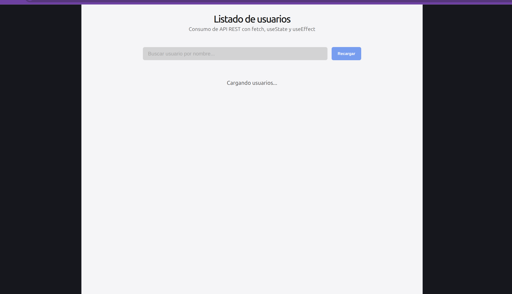
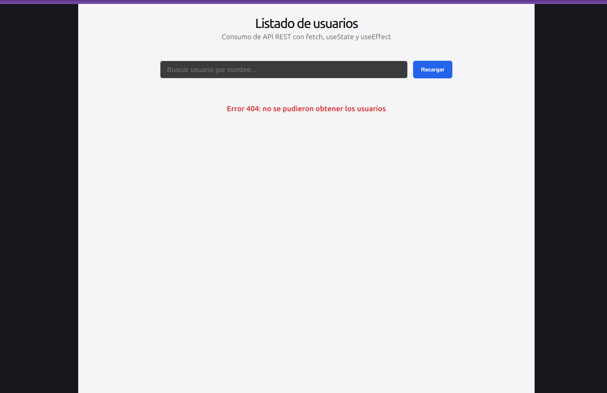
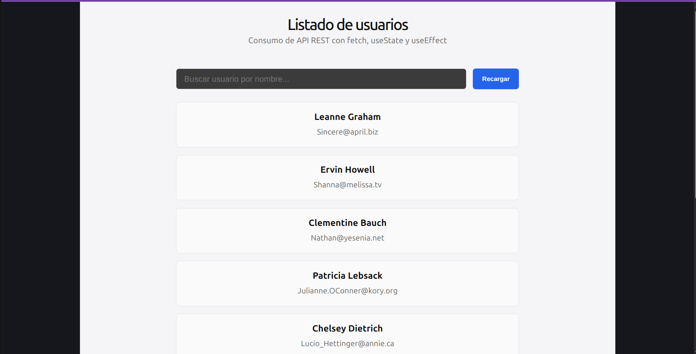

# api-rest-react

# 🔗 API REST en React — Listado de Usuarios

**Curso:** API REST — Centro de e-Learning UTN BA  
**Módulo:** 2 — Unidad 2  
**Autor:** Facundo Rodriguez

---

## 📸 Capturas de pantalla





---

## 📋 Descripción

Aplicación React (Vite) que consume la API pública `jsonplaceholder.typicode.com/users`
como entrega del módulo "API REST en React". Implementa `fetch` con `async/await` dentro
de `useEffect`, manejando los estados `usuarios`, `loading` y `error` con `useState`, y
valida `res.ok` antes de procesar la respuesta para un manejo explícito de errores. La
lista se renderiza de forma condicional según el estado (cargando, error o datos) y cada
usuario se muestra mediante un componente hijo `UsuarioCard`. Como extras, se incluyen un
botón "Recargar" que repite la solicitud y un buscador que filtra la lista por nombre en
tiempo real.

---

## 🚀 Cómo clonar e iniciar el proyecto

```bash
# 1. Clonar el repositorio
git clone https://github.com/FARO1993/modulo-2-tarea-2-utn-fullstack.git

# 2. Ingresar a la carpeta
cd modulo-2-tarea-2-utn-fullstack

# 3. Instalar dependencias
npm install

# 4. Iniciar el servidor de desarrollo
npm run dev
```

Abrí el navegador en `http://localhost:5173` (o el puerto que indique Vite en la terminal).

---

## 📁 Estructura del proyecto

```
modulo-2-tarea-2-utn-fullstack/
├── index.html
├── package.json
├── vite.config.js
├── .gitignore
└── src/
    ├── main.jsx
    ├── index.css
    ├── App.jsx
    ├── App.css
    └── components/
        └── UsuarioCard/
            └── UsuarioCard.jsx
        └── Usuarios/
            ├── Usuarios.jsx
            └── Usuarios.css
```

---

## 🧩 Conceptos y hooks utilizados

| Hook / Concepto | Uso en el proyecto |
|---|---|
| `useState` | Estados `usuarios`, `loading`, `error`, `busqueda` y `recargarKey` |
| `useEffect` | Ejecuta el `fetch` a la API al montar el componente y al recargar |
| `fetch` + `async/await` | Solicitud a `jsonplaceholder.typicode.com/users` con `try/catch` |
| `res.ok` | Validación de la respuesta antes de procesar los datos |
| Renderizado condicional | Muestra "Cargando...", el error o la lista según el estado |
| Componente hijo | `UsuarioCard` recibe cada usuario por props |

---

## 📚 Bibliografía y créditos

**Referencias:**
- Banks, A. y Porcello, E. *Learning React: Modern Patterns for Developing React Apps*. 2ª ed. O'Reilly Media, 2020.
- Flanagan, D. *JavaScript: The Definitive Guide*. 7ª ed. O'Reilly Media, 2020. https://share.google/NWtI0mj2jOuHpwbuu
- MDN Web Docs. *Window: fetch() method*. Mozilla Corporation. https://developer.mozilla.org/en-US/docs/Web/API/fetch
- React. *useState*. https://react.dev/reference/react/useState
- React. *useEffect*. https://react.dev/reference/react/useEffect
- Anthropic. Claude (modelo de inteligencia artificial). Utilizado como asistente para la generación y revisión del código de este proyecto. https://www.anthropic.com
